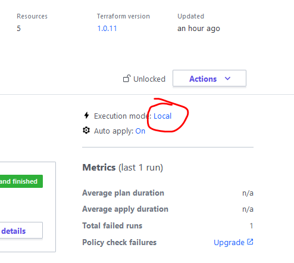

# Terraform Cloud Blueprint

## General

The blueprint installs getting-started terraform template on provided Terraform Cloud account.

## Requirements

In order to run successfully the blueprint you'll need an account on Terraform Cloud or your 
own Terraform Enterprise instance. Also, the workspace execution mode has to be configured as 
`local`. This is a [known limitation](https://discuss.hashicorp.com/t/saving-a-generated-plan-is-currently-not-supported/2116) of a Terraform Cloud/Enterprise, when it's being triggered 
using the Terraform CLI.

Example:

## Plugins

cloudify-terraform-plugin (v0.18.8 or later)

## Secrets

| Display Label                                                         | Name            | Type   | Default Value    |
| --------------------------------------------------------------------- | --------------- | ------ | ---------------- |
| Organization name in the TF Cloud/Enterprise                          | tf_organization | string |                  |
| Workspace name in the TF Cloud/Enterprise                             | tf_workspace    | string | default          |
| Authentication Token to be used in TF Cloud/Enterprise                | tf_token        | string |                  |
| Hostname of the TF Cloud/Enterprise (`app.terraform.io` for TF Cloud) | tf_hostname     | string | app.terraform.io |

## Inputs

No inputs.

## Node Types

### Terraform Binary
the node type is responisble for installing the terraform binary in v1.0.11
The type is `cloudify.nodes.terraform`. 

### TFC Module
the node type is responisble for installing the Getting Started module using [this repo](https://github.com/hashicorp/tfc-getting-started).
The type is `cloudify.nodes.terraform.Module`.

## Labels

The created deployment will have label `obj-type` equal to `terraform`

## Capabilities

No capabilities.
